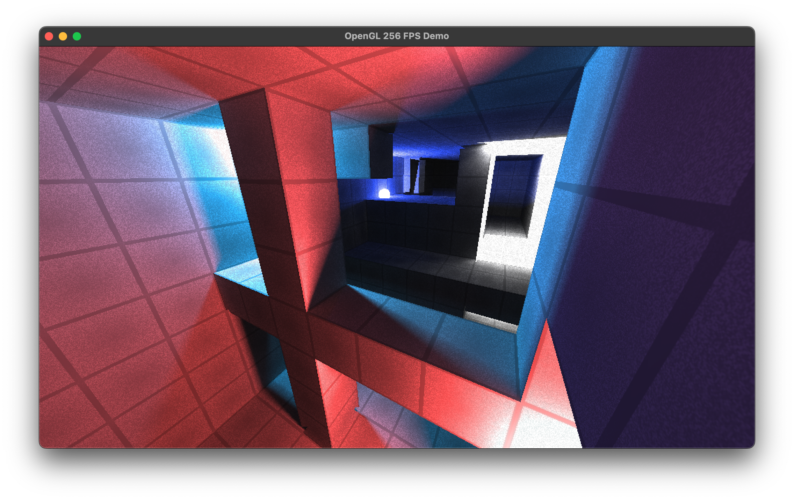
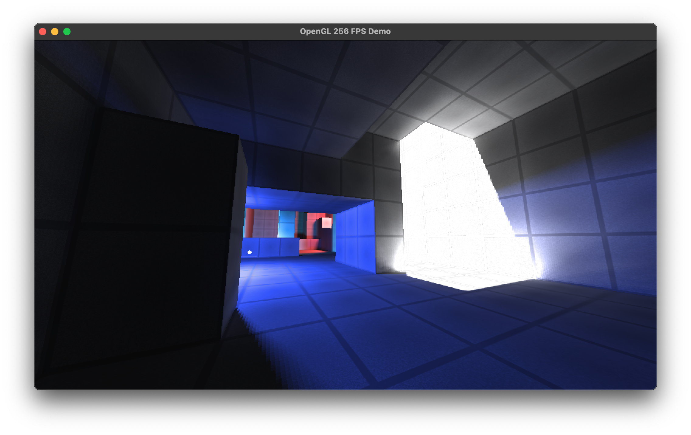

# OpenGL FPS demo



Немного модифицированный исходник из видео [Bisqwit'а](https://www.youtube.com/watch?v=vkUwT9U1GzA), позволюящий запустить его на macOS.

<details>
    <summary> ПЫСЫ </summary>
    Если постараться, то можно и на Windows запустить.
</details>

## Используемые зависимости
1. `SDL2`
2. `GLEW`

## Как запустить

```bash
$ brew install sdl2 glew    # ставим пакеты
$ make                      # компилируем
$ cd bin                    # переходим
$ ./demo                    # запускаем
```

По итогу увидим это.



## Управление

* `WASD` : передвижение
* `Мышка` : вращение камеры
* `LMB, RMB` : Создание порталов
* `SPACE` : Прыжок
* `1 / 2` : Изменения угла обзора
* `B` : создание объекта
* `T` : ВКЛ/ВЫКЛ вращение мышью 

## Нюансы
* Не работает Dithering. В оригинале он работал через прямое изменения framebuffer'а у контекста, но я без понятия как это сделать на маке. Через шейдеры?
* Карта отзеркалена горизонтально. Я без понятия почему. Вообще, она изначально была перевернута, но я поправил это, повернув камеру (up.y = 1 вместо -1) и инвертировав управление.
* Иногда появляются артефакты с depth buffer'ом у вертексов если они будут далеко от камеры. Это из-за плавающей точки скорее всего. Такое можно поправить depth framebuffer'ом большей точности.
* Оказывается, тут есть реализация порталов и actor'ов (объекты в виде кругов).

